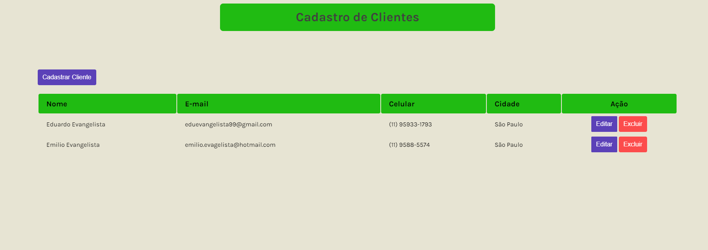

# CRUD - Cadastro de clientes

🔗[Clique aqui para acessar](https://eduevangelista.github.io/firstCrud/)

## 🛠 Tecnologias   

- Java Script
- HTML
- CSS
- Git e Github

## 🕑 Desenvolvimento do projeto

- Criado à partir da video aula do professor Fernando Leonid utilizando o localStorage como banco de dados. Tudo isso utilizando HTML, CSS e javascript puro.

## 📞 Contato
- eduevangelista99@gmail.com
- (11) 95933-1973
